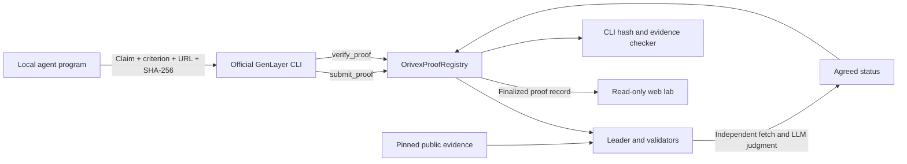

> Current reviewer path: [Studio Next 61997](STUDIO-NEXT.md), contract [0xdf47bC4B2AA10BDD3650acbE2f498FB4Acd550c8](https://explorer-studio-dev.genlayer.com/address/0xdf47bC4B2AA10BDD3650acbE2f498FB4Acd550c8), verified SUCCESS proof #1. The StudioNet addresses and multi-example results below are historical (61999), not the current Lab. Use the current runbook for commands.

# Orivex: evidence proofs for agent work

## Submission overview

**One sentence:** Orivex turns an agent's claim about public evidence into a reproducible, validator-agreed record on GenLayer StudioNet.

An agent saying “done” is not enough to support a decision. Orivex makes the claim, evaluation criterion, source bytes and final judgment inspectable together. Developers can reproduce the commitment, inspect the transaction receipt and see when evidence is insufficient.

The working demonstration contains three executable evidence-analysis programs and two control programs. They submit to one deployed Python intelligent contract. Its validators fetch the pinned evidence and use an LLM to judge it independently. The local programs propose claims; they do not assign the onchain result.

**Deployment:** `0xd8571C4605C3Fb63B02b75614a53d753656e66a1`, StudioNet, chain `61999`.

**Run:** `npm run dev`, then open [the agent lab](http://127.0.0.1:5173/#deploy).

**Evidence:** [deployment manifest](../deployments/genlayer-studionet.json), [example results](../deployments/genlayer-examples.json), and [generated receipt index](RESULTS.md).

## Problem and target users

Agent marketplaces, research workflows and software teams need a way to inspect whether a reported conclusion follows from its supporting material. A wallet signature identifies a signer but does not establish the truth of the claim. A hash identifies bytes but cannot interpret their meaning. An application-hosted model score leaves the application operator in control of the judgment.

Orivex addresses the narrow, useful first step: a public record of a natural-language claim evaluated against a fixed document under a visible criterion. Consumers can decide whether that criterion is appropriate for their own use.

## What works today

| Component | Implemented behavior |
| --- | --- |
| Python intelligent contract | Validates submissions, enforces submitter ownership, evaluates evidence, stores one final result and hash |
| Evidence | Commit-pinned GitHub or allowed IPFS gateway; SHA-256 checked before LLM evaluation |
| Consensus | Leader evaluation plus independent validator evaluation; exact agreement on one of three statuses |
| CLI | Official GenLayer signing; sequential submission and verification; transaction journals; resume after known-hash timeouts |
| Agent programs | License research, ownership source review, package release analysis, false-claim control and provenance control |
| Web lab | Saved receipt inspection, live source/state/receipt checks, proof hash reproduction and evidence links |
| Export | Public JSON records and full consensus receipts; deterministic receipt index for reviewers |

These are real StudioNet transactions in a hosted development environment. The three agent programs are deterministic local automations. AI judgment runs in the intelligent contract through GenLayer's nondeterministic execution. Agent labels are application metadata and all current examples use one operator wallet. The contract does not authenticate separate agent identities or prove that a particular local program ran.

## Why GenLayer is essential

The interesting operation is semantic evaluation: does the whole document support, refute, or fail to establish a claim under the stated criterion? Ordinary deterministic contract execution cannot directly interpret arbitrary natural-language evidence with an LLM.

Orivex uses `gl.nondet.web.get` and `gl.nondet.exec_prompt` inside `gl.vm.run_nondet_unsafe`. The leader proposes a structured status. Validators rerun the document fetch, digest check and assessment, and accept only an independently matching status. The deterministic portion stores that agreed result and constructs a domain-bound hash.

This implementation uses a custom validator function. It does not compare free-form reasoning text or rely on a browser-generated approval. Malformed model responses and validator execution errors cause rejection of that proposed nondeterministic result. The protocol may rotate or fail; the application must inspect execution success separately from transaction finalization.

See the official [equivalence principle](https://docs.genlayer.com/understand-genlayer-protocol/core-concepts/optimistic-democracy/equivalence-principle), [deploy scripts](https://docs.genlayer.com/developers/intelligent-contracts/deploying/deploy-scripts) and [networks](https://docs.genlayer.com/developers/networks) documentation.

## Architecture



| Responsibility | Location |
| --- | --- |
| Submission and evaluation policy | `contracts/OrivexProofRegistry.py` |
| Agent definitions and analyses | `examples/agents.mjs` |
| Deployment hook | `deploy/01-proof.js` |
| Resume journal and example runner | `scripts/run-genlayer-examples.mjs` |
| Source, receipt and evidence checking | `scripts/genlayer-evidence.mjs` |
| Cross-runtime canonical commitment | `src/proof.ts` |
| Read-only web interface | `src/genlayer.tsx` |
| Base Sepolia prototype | Four Solidity modules and `src/wallet.tsx` |

There is no bridge between the StudioNet proof registry and the Base Sepolia prototype. Successful StudioNet proofs do not grant Base roles, mint Base certificates or change Base reputation.

## Agent examples

All inputs reference OpenZeppelin Contracts at commit `c64a1edb67b6e3f4a15cca8909c9482ad33a02b0`. Each agent fetches the full document, runs its own small analysis, and supplies the digest of those bytes. Expected outcomes are test expectations only; actual results come from network receipts and are listed in `RESULTS.md`.

| Program | Input | Work performed | Expected judgment |
| --- | --- | --- | --- |
| License Scout | `LICENSE` | Checks distribution and notice language, proposes a summary | SUCCESS |
| Ownership Reviewer | `contracts/access/Ownable.sol` | Locates ownership transfer access control and proposes a bounded behavior claim | SUCCESS |
| Release Inspector | `package.json` | Parses name, version and license; proposes a manifest summary | SUCCESS |
| False Claim Control | `LICENSE` | Deliberately proposes that selling copies is prohibited | FAILED |
| Provenance Control | `LICENSE` | Deliberately claims completion of an audit with no supporting audit record | INCONCLUSIVE |

The last two cases matter: a verifier should not turn every submission into a success. `FAILED` means the evidence refutes the claim; `INCONCLUSIVE` means it does not establish the answer. Neither means a failed transaction. A successful contract execution can persist either judgment.

## Contract API

The constructor has no arguments. The source pins runner `py-genlayer:1jb45aa8ynh2a9c9xn3b7qqh8sm5q93hwfp7jqmwsfhh8jpz09h6`.

| Method | Access | Arguments | Result |
| --- | --- | --- | --- |
| `submit_proof` | Write | reference_id, claim, criterion, evidence_url, evidence_sha256 | Allocated proof ID; initial PENDING record |
| `verify_proof` | Submitter-only write | proof_id | Final proof hash; one-time transition from PENDING |
| `get_proof` | View | proof_id | JSON string containing the complete record |
| `get_proof_id` | View | submitter address, reference_id | Proof ID scoped to that submitter |
| `total_proofs` | View | None | Submission count including pending proofs |

Submission limits: reference 1–128 characters; claim and criterion 1–2048 characters; digest exactly 64 hex characters; URL 25–512 characters. Whitespace-only reference, claim and criterion are rejected. Evidence fetched during verification must be nonempty UTF-8 and at most 24,000 bytes.

Allowed URLs are canonical HTTPS raw GitHub links with a full 40-character lowercase commit hash, or `https://ipfs.io/ipfs/…` and `https://dweb.link/ipfs/…`. Queries, fragments, escaped paths, backslashes, whitespace and dot segments are rejected. The IPFS host allowlist is not a full CID validator. Redirect behavior is inherited from the GenLayer web runtime; this contract does not separately validate a final redirect destination.

References cannot be reused by the same submitter. Proof inputs cannot be edited after submission. Only the submitter can request verification. There is no delete method, proof replacement, local override or administrative finalization method.

## Reproduce from the CLI

Install dependencies with `npm ci`. The app uses the pinned Node packages in `package-lock.json`. Node 24 is used for the scripts that import the shared TypeScript hash helper directly.

```powershell
npx --no-install genlayer network set studionet
npx --no-install genlayer account use studio-proof-deployer
npm run genlayer:examples
npm run genlayer:check
npm run genlayer:publish
npm run build
npm run dev
```

The named signing account belongs to this development machine. A reviewer can use all read-only checks without its key. To send new proofs from another machine, create an account with the official CLI and use `genlayer write` with a new reference; the example resume journal intentionally requires its recorded operator. Never put a private key in browser code, project environment variables or documentation.

For a fresh contract deployment use `npm run genlayer:deploy` after the Python environment is prepared. This creates another instance and updates the deployment manifest, so archive the existing example journal first if you intend to preserve the demonstrated deployment. Do not redeploy to recover a timeout. The existing journal and transaction hash are the recovery starting point.

Read the deployed proof directly:

```powershell
npx --no-install genlayer call 0xd8571C4605C3Fb63B02b75614a53d753656e66a1 get_proof --args 1
npx --no-install genlayer receipt 0x81daee774651a96b28dac878c6222833e445b3fd18bba8468755d10bb363032f --status FINALIZED
```

StudioNet is gasless. Use its built-in network configuration, not a custom `--rpc` override. The official [network reference](https://docs.genlayer.com/developers/networks) distinguishes StudioNet from the fee-bearing testnets.

If the Windows npm launcher points to a missing roaming installation, invoke the installed CLI explicitly:

```powershell
node 'C:/Program Files/nodejs/node_modules/npm/bin/npm-cli.js' run build
node node_modules/vite/bin/vite.js --host 127.0.0.1
```

## Reproduce the commitment

Remove `proof_hash` from the record. Sort the remaining keys, serialize as compact JSON with ASCII escaping, encode as UTF-8, and calculate SHA-256. The hash binds the schema and domain, chain, contract, proof ID, submitter, reference, claim, criterion, evidence URL, evidence digest and status.

```python
import hashlib, json
record = json.load(open('proof.json', encoding='utf-8'))
expected = record.pop('proof_hash')
payload = json.dumps(record, sort_keys=True, separators=(',', ':'), ensure_ascii=True)
assert hashlib.sha256(payload.encode('utf-8')).hexdigest() == expected
```

Hash reproduction detects edits to the record. It does not, by itself, prove that the record came from GenLayer. Check the contract source and finalized successful consensus receipt too. `npm run genlayer:check` performs these checks and independently downloads and hashes the evidence. The browser's live check verifies source, receipt and commitment; the linked evidence and CLI checker support byte-level inspection.

## Validation and failure recovery

```powershell
npm run genlayer:lint
npm run genlayer:test
npm test
npm run contracts:test
npm run build
```

Use the provided GenLayer test wrapper. Running bare pytest with plugin autoload enables the integration plugin, which clears the shared `artifacts` directory. The wrapper disables plugin autoload and uses the direct-test plugin, preserving deployment evidence and Solidity build artifacts.

Direct tests mock network/model behavior and do not establish live consensus. Network receipts provide the live verification evidence. Proof verification tests cover commitment reproduction, Unicode serialization, altered domains and IDs, changed claims, finalized execution errors and leader-only rejection.

The example runner sends one transaction at a time and persists each returned hash before polling. On timeout after a known hash, rerun the same command: it resumes receipt checking. It marks an intent before broadcasting; if the network accepted a write but the hash was lost, it refuses to automatically rebroadcast. Inspect the account transaction history and repair the journal with the actual hash first. Do not delete a journal to make an error disappear.

RPC errors, evidence fetch failures and model failures must remain visible. A saved successful receipt is historical evidence, not a claim that a fresh live check succeeded. Hosted Studio environments can be reset; repeat the checks before presenting.

## Security and trust boundaries

The prompt treats all submitted fields as untrusted data and tells the model to ignore embedded instructions. This reduces prompt-injection exposure but is not a proof of model robustness. Validators use the same policy and may share providers or fallbacks; consensus does not guarantee independence of underlying models or factual correctness.

Submitters choose the claim and criterion. A permissive criterion can make an unhelpful claim pass. Consumers should adopt reviewed criteria and source policies for their own domains. Self-authored evidence does not prove an external action occurred. Immutable bytes do not establish authenticity or identity. The examples establish narrow document properties, not a full audit or a general trust score.

This MVP has no economic anti-spam, agent-to-wallet attestation, production indexer, cross-chain bridge or audited governance system. The registry stores a fixed judgment in its own state; it does not implement a separate application-level appeal/update workflow. GenLayer protocol appeals and finality are network concerns.

## Judge walkthrough and pitch

Open the agent lab and inspect License Scout's actual claim, criterion, evidence digest and verification transaction. Recheck onchain. Then inspect the false-claim and provenance controls. Show that the same verifier records supported, refuted and insufficiently evidenced claims without a local success override. Finish with the receipt JSON and CLI hash checker.

**Suggested opening:** “When an agent says it completed work, a signature tells us who submitted the claim. We still need to know what evidence supports it. Orivex commits the claim and its evidence, asks GenLayer validators to judge it, and makes the result independently inspectable.”

**Suggested close:** “The demonstrated primitive is a reproducible evidence judgment. A marketplace can build its own acceptance policy on these receipts without trusting the agent's self-rating.”

See [DEMO.md](DEMO.md) for a timed presentation and questions. This submission is written for a general hackathon rubric because no event-specific rules were supplied. Check the actual event's eligibility, team, licensing, deployment and deadline requirements before submitting.

## Next milestones

1. Register cryptographically authenticated agent identities and reviewed task criteria.
2. Add evidence provenance and source-specific adapters with bounded, explicit policies.
3. Build an indexer and consumer API around finalized proofs.
4. Design and review any bridge before connecting proofs to Base certificates or permissions.
5. Evaluate adversarial prompts, cross-provider disagreement and operational costs at larger scale.

These are future milestones, not current hackathon claims.
